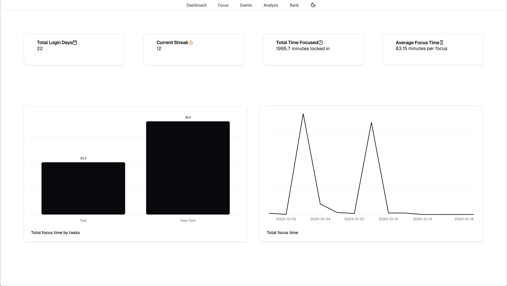
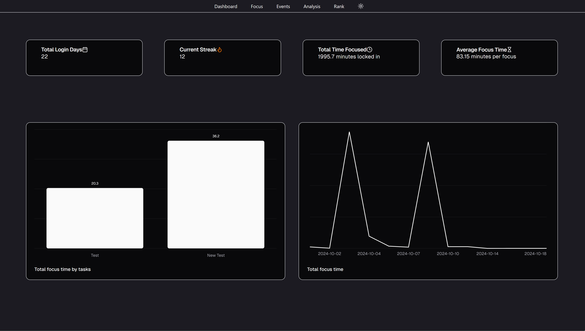
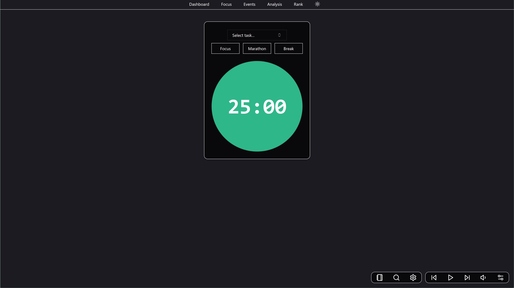
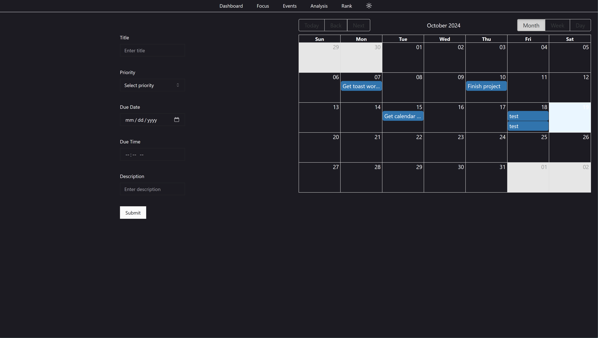
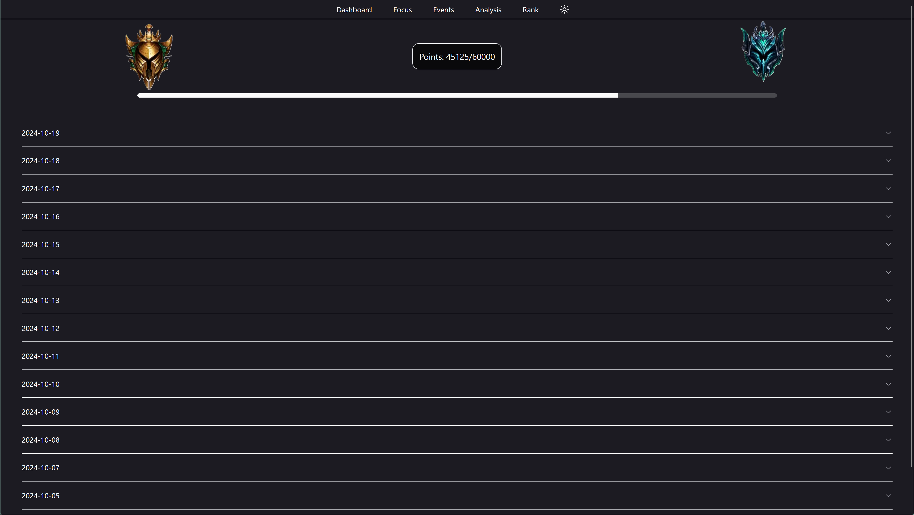

# Images

### Light/Dark Mode + Dashboard 


### Timer

### Events + To-Dos

### Rank System



## Goals/Milestones :

### Dashboard: 

* [x] Static Cards (Widgets): Total timed, total days using the application, logging in streak, average study time per session 
* [ ] Pie Chart: Hours spread out for each different course/class/subject
* [x] Bar Chart: Hours spent on different assignments/tests, etc.
* [x] Line Chart: The total time spent throughout the month (or year)
* [ ] Current progress towards a current set goal (can select which one to view)

### Studying/Focus:

* [x] Create different tasks
* [x] Continue a current task
* [x] Create a section to implement Google search 
* [x] Create a section to implement audio preferences (refer to music section)
* [x] Have a timer    
* [x] Create a section to allow for customizing the timer (sound, time, breaks, etc.)
* [ ] Create goals for separate courses/subjects
* [x] Create a section to take notes (not saved)
* [x] "Marathon" would be an automatic longer version of regular focus and be continuous, i.e. auto breaks.
* [ ] Add in option to allow browser only mode (prevents user from leaving tab after timer has started)
* [X] Warn user when leaving page (within the same site) or refreshing page if timer is started or there are notes
* [ ] Ability to delete task (should not remove from DB)

### Studying Analysis Tool (Planned): 

* [ ] This will be a page dedicated to other stuff or extra information that is cool to know but isn't really important (not included in the dashboard)
* [ ] Seeing the history of the studies (sorted/grouped by the different courses/subjects)
* [ ] Using the user's data and trends, organize some tips that will pop up
* [ ] Seeing any noticeable trends such as peak times or the subjects that were spent the most time on
* [ ] Using data, suggest some goals for the user (i.e. if studies for 5 hours, go for 6 hours or if a user neglects one of their subjects/course, suggest goals for that subject)

### To-Do:

* [X] Create to-dos 
* [X] Store to-dos
* [X] Set deadlines (link with a calendar)
* [X] Notify upcoming deadlines (alerts on page open)
* [X] Current calendar that contains all the deadlines or any scheduled studying sessions (should be interactive, can add dates and deadlines)

### Music:
* [x] Play music audio 
* [x] Skip forward/backward song/audio
* [x] Add preferences

### Milestone/Rank: 

* [X] Track how long the user has logged in for 
* [X] Track how many consecutive days (streak) the user has been logged in for
* Queries the different days and checks if they are back to back.
* [X] Create a rank system for these data points (bronze, silver, etc.)
* Lose points for not accomplishing certain milestones
* [X] Have medals/achievements for reaching certain points
* [X] Show current rank
* [X] Show progression towards next rank

### Studying Habits (WIP):

* [ ] Try to promote healthy studying habits.

### Goals
* [ ] Create goals 
* Should be progressable and trackable.
* [ ] Track goals 
* [ ] Grant points for completing or progressing through the goals
* [ ] Lose points for neglecting or not finishing goals
* [ ] Delete goal

## Getting Started

This is a [Next.js](https://nextjs.org) project bootstrapped with [`create-next-app`](https://nextjs.org/docs/app/api-reference/cli/create-next-app).

First, run the development server:

```bash
npm run dev
# or
yarn dev
# or
pnpm dev
# or
bun dev
```

Open [http://localhost:3000](http://localhost:3000) with your browser to see the result.
